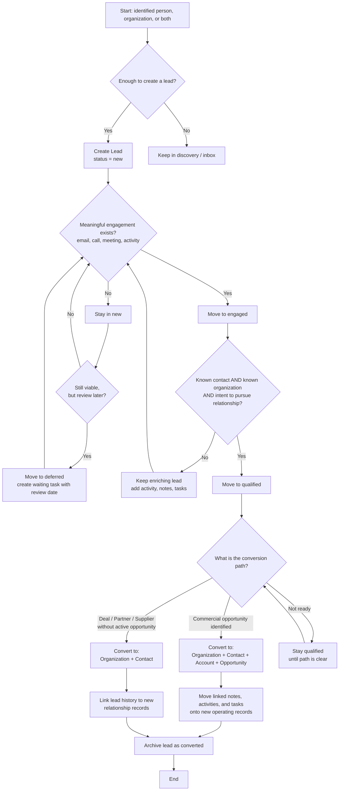

# CRM Lead Manager Flowchart

## Notes

- `new` means identified but not yet meaningfully engaged.
- `deferred` means still viable but parked for later review; use a `waiting` task with a future `due-date`.
- `engaged` requires a real interaction with a known contact.
- `qualified` requires a known contact, known organization, and intent to pursue a structured relationship.
- `converted` can follow either the commercial path or the relationship-only path.
